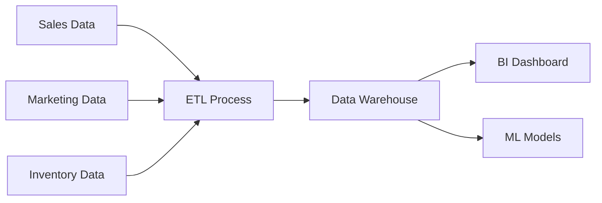
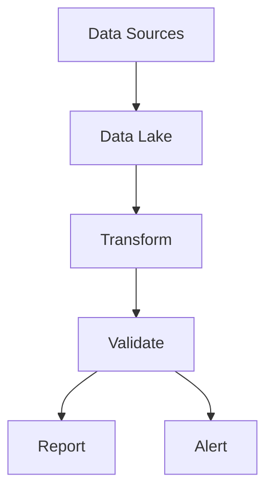

# Use Cases & Success Stories

## Industry Solutions

### Financial Services
- **Automated Reporting**
  - Daily P&L calculations
  - Risk analytics
  - Regulatory compliance reporting
  - Customer portfolio analysis

- **Success Story: Global Investment Bank**
  > Reduced reporting time from 5 days to 4 hours by automating data integration from 20+ sources

### E-commerce
- **Customer Analytics**
  - 360° customer view
  - Purchase behavior analysis
  - Inventory optimization
  - Marketing attribution

- **Success Story: Pincho Nation**
  > Achieved double-speed insights and six-figure revenue growth through improved data analytics

### Manufacturing
- **Operations Optimization**
  - Supply chain analytics
  - Quality control monitoring
  - Predictive maintenance
  - Resource allocation

- **Success Story: P3 Logistic Parks**
  > Optimized operations across 11 countries with centralized data management

## Common Use Cases

### Data Integration
1. **Multi-source Data Consolidation**
   - Challenge: Scattered data across systems
   - Solution: Automated data extraction and centralization
   - Result: Single source of truth for all analytics

2. **Real-time Data Sync**
   - Challenge: Delayed decision making
   - Solution: Real-time data pipeline automation
   - Result: Up-to-the-minute insights

### Analytics & BI
1. **Automated Reporting**
   - Challenge: Manual report creation
   - Solution: Scheduled data transformations
   - Result: Automated daily/weekly reports

2. **Self-service Analytics**
   - Challenge: Dependent on IT for data access
   - Solution: Governed data access
   - Result: Empowered business users

### Machine Learning
1. **Model Development**
   - Challenge: Data preparation bottlenecks
   - Solution: Automated feature engineering
   - Result: Faster model iteration

2. **Production Deployment**
   - Challenge: Model deployment complexity
   - Solution: Integrated ML pipelines
   - Result: Streamlined ML operations

## Implementation Examples

### E-commerce Analytics Pipeline

### Financial Reporting Workflow

## ROI Analysis

### Cost Savings
- 60% reduction in data preparation time
- 40% decrease in reporting costs
- 75% reduction in manual data entry

### Revenue Impact
- 25% increase in customer retention
- 15% improvement in marketing ROI
- 30% faster time-to-market

## Getting Started

1. **Assessment**
   - Identify data sources
   - Define business objectives
   - Map current processes

2. **Implementation**
   - Set up data pipelines
   - Configure transformations
   - Establish monitoring

3. **Optimization**
   - Monitor performance
   - Gather feedback
   - Iterate and improve

## Related Resources
- [Technical Documentation](technical-documentation.md)
- [Data Governance](data-governance.md)
- [Pricing & ROI](pricing-and-roi.md) 