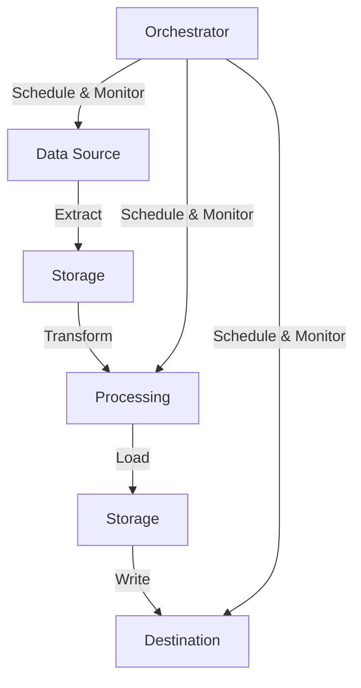

# Keboola Full Documentation

> Keboola is a cloud-based data operations platform that empowers businesses to automate data workflows, manage data integration, and enable advanced data analytics. This document provides a comprehensive guide for both new and experienced users, including setup commands, API access details, and key tutorials.

## Table of Contents

1. [Key Features](#key-features)
2. [Getting Started](#getting-started)
   - [Setting Up Your Project](#setting-up-your-keboola-project)
   - [Installation](#installation)
   - [Authentication](#authentication)
3. [API Access](#api-access-details)
   - [Storage API](#storage-api)
   - [Management API](#management-api)
   - [Queue API](#queue-api)
   - [Encryption API](#encryption-api)
   - [Transformation API](#transformation-api)
4. [Client Libraries](#client-libraries)
   - [Storage API Python Client](#storage-api-python-client)
   - [Python Component Library](#python-component-library)
5. [Command Line Interface](#command-line-interface-cli)
6. [Tutorials](#tutorials)
   - [Basic Workflow Setup](#basic-workflow-setup)
   - [Advanced Tutorials](#advanced-tutorials)
7. [Advanced Features](#advanced-features)
8. [Troubleshooting](#troubleshooting)
9. [Support Resources](#support-resources)

## Key Features

- **Data Integration**: Connect, extract, and load data from over 250 sources including databases, SaaS platforms, and APIs.
- **Data Transformation**: Use SQL, Python, R, or other languages to transform and prepare data in a version-controlled environment.
- **Orchestration**: Automate workflows with scheduling tools to keep your data pipelines up-to-date.
- **Data Governance**: Ensure compliance with built-in governance tools like observability, lineage tracking, and auditing.
- **Scalability**: Scale effortlessly with cloud infrastructure to meet growing organizational needs.
- **Collaboration**: Share assets and work collaboratively on data projects to accelerate insights.

## Getting Started

### Setting Up Your Keboola Project

1. **Create a Project**:
   - Sign up for a free trial or create a project at [Keboola](https://www.keboola.com).
   - Access the project dashboard after logging in.

2. **Install the CLI**:
   ```bash
   npm install -g @keboola/cli
   ```

3. **Initialize Your Project**:
   ```bash
   mkdir my-kbc-project
   cd my-kbc-project
   kbc init
   ```

4. **Authentication**:
   ```bash
   # Set up your Storage API token
   export KBC_STORAGE_TOKEN="your-storage-api-token"
   
   # Or use a configuration file
   echo "KBC_STORAGE_TOKEN=your-storage-api-token" > .env
   ```

### Basic Data Flow


---

## Tutorials

### Basic Workflow Setup

1. Extract data from a source (e.g., Google Sheets or BigQuery).
2. Transform the data using SQL or Python in Keboola's transformation environment.
3. Load the transformed data into a destination (e.g., Snowflake or Tableau).
4. Automate the pipeline using orchestration tools.

### Advanced Tutorials

- [Connecting BigQuery](https://help.keboola.com/storage/byobq/): Learn how to configure Google Cloud resources for BigQuery integration.
- [Automating Workflows](https://help.keboola.com/tutorial/automate/): Set up orchestrations for end-to-end automation of your pipelines.

---

## API Access Details

Keboola provides several APIs for managing and automating tasks. Each API serves a specific purpose and requires appropriate authentication.

### Storage API

The Storage API is the core API for managing data in Keboola.

#### Key Features
- Bucket and table management
- File uploads and downloads
- Data import and export
- Metadata management

#### Common Endpoints
```bash
# List buckets
GET /v2/storage/buckets

# Create table
POST /v2/storage/buckets/{bucketId}/tables

# Import data
POST /v2/storage/tables/{tableId}/import

# Export data
GET /v2/storage/tables/{tableId}/export
```

#### Authentication
```bash
curl -H "X-StorageApi-Token: your-token" \
     https://connection.keboola.com/v2/storage/buckets
```

### Management API

The Management API handles project and user management tasks.

#### Key Features
- Project administration
- User management
- Feature configuration
- Billing and usage monitoring

#### Common Endpoints
```bash
# List projects
GET /v2/manage/projects

# Manage users
POST /v2/manage/projects/{projectId}/users

# Update features
PATCH /v2/manage/projects/{projectId}/features
```

### Queue API

The Queue API manages asynchronous job execution.

#### Key Features
- Job scheduling
- Status monitoring
- Result retrieval
- Error handling

#### Common Endpoints
```bash
# Create job
POST /v2/jobs

# Get job status
GET /v2/jobs/{jobId}

# List jobs
GET /v2/jobs?limit=10&offset=0
```

### Encryption API

The Encryption API handles secure data encryption tasks.

#### Key Features
- Key management
- Data encryption
- Secure configuration storage
- Credential management

#### Common Endpoints
```bash
# Encrypt value
POST /v2/encrypt

# Decrypt value
POST /v2/decrypt
```

### Transformation API

The Transformation API manages data transformation processes.

#### Key Features
- SQL transformations
- Python/R script execution
- Transformation versioning
- Phase management

#### Common Endpoints
```bash
# Create transformation
POST /v2/transformations

# Run transformation
POST /v2/transformations/{transformationId}/run

# Get transformation logs
GET /v2/transformations/{transformationId}/logs
```

### API Best Practices

1. **Rate Limiting**
   - Implement exponential backoff
   - Cache responses when possible
   - Use batch operations

2. **Error Handling**
   - Handle HTTP status codes
   - Implement retry logic
   - Log API responses

3. **Security**
   - Store tokens securely
   - Use HTTPS only
   - Rotate tokens regularly

4. **Performance**
   - Use incremental processing
   - Optimize request frequency
   - Monitor API usage

### Example: Complete API Workflow

```python
import requests
from typing import Dict, List

class KeboolaAPI:
    def __init__(self, token: str, base_url: str = "https://connection.keboola.com/v2"):
        self.token = token
        self.base_url = base_url
        self.headers = {
            "X-StorageApi-Token": token,
            "Content-Type": "application/json"
        }
    
    def create_bucket(self, name: str, stage: str = "in") -> Dict:
        """Create a new bucket."""
        url = f"{self.base_url}/storage/buckets"
        data = {
            "name": name,
            "stage": stage
        }
        response = requests.post(url, headers=self.headers, json=data)
        response.raise_for_status()
        return response.json()
    
    def upload_table(self, bucket_id: str, name: str, file_path: str) -> Dict:
        """Upload a table from CSV file."""
        url = f"{self.base_url}/storage/buckets/{bucket_id}/tables-async"
        with open(file_path, 'rb') as file:
            files = {
                'data': file,
                'name': (None, name),
                'primaryKey[]': (None, 'id')
            }
            response = requests.post(url, headers={"X-StorageApi-Token": self.token}, files=files)
            response.raise_for_status()
            return response.json()
    
    def run_transformation(self, config: Dict) -> Dict:
        """Run a transformation job."""
        url = f"{self.base_url}/transformations/run"
        response = requests.post(url, headers=self.headers, json=config)
        response.raise_for_status()
        return response.json()
    
    def monitor_job(self, job_id: str) -> Dict:
        """Monitor job status."""
        url = f"{self.base_url}/jobs/{job_id}"
        while True:
            response = requests.get(url, headers=self.headers)
            response.raise_for_status()
            status = response.json()
            if status['status'] in ['success', 'error']:
                return status
            time.sleep(5)
```

### Example: Using the Storage API with cURL

To list all buckets in your project:
```bash
curl -X GET https://connection.keboola.com/v2/storage/buckets \
-H "X-StorageApi-Token: YOUR_STORAGE_API_TOKEN"
```

### Storage API Python Client

The Storage API Python Client provides a convenient way to interact with Keboola's Storage API programmatically using Python. Here's how to use it:

#### Installation

```bash
pip3 install keboola.storage.client
```

#### Basic Usage

```python
from keboola.storage.client import Client

# Initialize the client with your Storage API token
client = Client(token='your-storage-api-token')

# List all buckets
buckets = client.buckets.list()

# Create a new bucket
new_bucket = client.buckets.create('new-bucket-name', stage='in', description='My new bucket')

# List tables in a bucket
tables = client.buckets.list_tables('bucket-id')

# Create a new table from CSV file
table = client.tables.create_from_file('bucket-id', 'table-name', 'path/to/file.csv')

# Load data into existing table
client.tables.load(table_id='table-id', file_path='path/to/file.csv', is_incremental=True)

# Export table to CSV
client.tables.export_to_file(table_id='table-id', path_name='path/to/export.csv')
```

#### Advanced Features

1. **Working with Table Metadata**
```python
# Get table metadata
table_info = client.tables.detail('table-id')

# Update table metadata
client.tables.update(
    table_id='table-id',
    new_name='new-table-name',
    new_description='Updated description'
)
```

2. **Managing Table Data**
```python
# Preview table data
preview = client.tables.preview('table-id', limit=100)

# Delete rows from table
client.tables.delete_rows('table-id', where_column='id', where_values=['1', '2', '3'])

# Create table with defined primary key
client.tables.create(
    name='my-table',
    bucket_id='bucket-id',
    primary_key=['id', 'date'],
    column_headers=['id', 'date', 'value']
)
```

3. **Working with Files**
```python
# Upload file to file storage
file_id = client.files.upload_file('path/to/local/file.csv', tags=['tag1', 'tag2'])

# List files with specific tags
files = client.files.list(tags=['tag1'])

# Download file from file storage
client.files.download(file_id, 'path/to/save/file.csv')
```

4. **Error Handling**
```python
from keboola.storage.client import ClientException

try:
    client.buckets.detail('non-existent-bucket')
except ClientException as e:
    print(f"Error occurred: {e}")
```

#### Best Practices

1. **Token Management**
   - Store API tokens securely (e.g., environment variables)
   - Use tokens with minimal required permissions
   - Rotate tokens periodically

2. **Performance Optimization**
   - Use incremental loads when possible
   - Batch operations for multiple files/tables
   - Implement proper error handling

3. **Data Validation**
   - Verify data types before upload
   - Use primary keys when data integrity is crucial
   - Validate CSV formats before loading

4. **Resource Management**
   - Clean up temporary files after processing
   - Monitor storage usage
   - Implement proper logging

### Python Component Library

The Keboola Python Component library provides a robust framework for building Python applications that run in the Keboola Connection environment. It simplifies common tasks related to the Keboola Common Interface, such as configuration handling, I/O operations, logging, and state management.

#### Installation

```bash
pip3 install keboola.component
```

#### Core Modules

1. **Interface Module** (`keboola.component.interface`)
   - Handles core Common Interface tasks
   - Manages environment initialization
   - Processes configuration files
   - Handles data folder operations

2. **DAO Module** (`keboola.component.dao`)
   - Contains data classes for Common Interface objects
   - Manages manifest files and metadata
   - Handles environment variables

3. **Base Module** (`keboola.component.base`)
   - Provides base classes for building Keboola Components
   - Implements common functionality and patterns

#### Basic Component Structure

```python
from keboola.component.base import ComponentBase
from keboola.component import UserException
import logging

class Component(ComponentBase):
    def __init__(self):
        super().__init__()
    
    def run(self):
        # Validate configuration parameters
        self.validate_configuration_parameters(['required_parameter'])
        
        # Access configuration
        params = self.configuration.parameters
        
        # Create output table
        table = self.create_out_table_definition('output.csv', 
                                               incremental=True,
                                               primary_key=['id'])
        
        # Process data and write to output
        with open(table.full_path, 'w') as out_file:
            # Your data processing logic here
            pass
        
        # Write table manifest
        self.write_manifest(table)

if __name__ == "__main__":
    try:
        comp = Component()
        comp.execute_action()
    except UserException as exc:
        logging.exception(exc)
        exit(1)
    except Exception as exc:
        logging.exception(exc)
        exit(2)

#### Advanced Features

1. **Table Schemas**
```python
# Define schema in JSON
{
    "name": "product",
    "primary_keys": ["id"],
    "fields": [
        {
            "name": "id",
            "base_type": "string",
            "nullable": false
        },
        {
            "name": "name",
            "base_type": "string",
            "length": "1000"
        }
    ]
}

# Use schema in component
class Component(ComponentBase):
    def run(self):
        schema = self.get_table_schema_by_name('product')
        table = self.create_out_table_definition_from_schema(schema)
        # Process data using schema-defined structure
```

2. **Sync Actions**
```python
from keboola.component.base import ComponentBase, sync_action
from keboola.component.sync_actions import ValidationResult, MessageType

class Component(ComponentBase):
    @sync_action('testConnection')
    def test_connection(self):
        # Test connection logic
        connection = self.configuration.parameters.get('connection')
        if not self.test_connection(connection):
            raise UserException("Connection failed")
        
    @sync_action('validate')
    def validate_config(self) -> ValidationResult:
        return ValidationResult("Configuration valid", MessageType.SUCCESS)
```

3. **State Management**
```python
class Component(ComponentBase):
    def run(self):
        # Read previous state
        previous_state = self.get_state_file()
        last_run = previous_state.get('last_run')
        
        # Process data incrementally
        new_data = self.process_new_data(since=last_run)
        
        # Save new state
        self.write_state_file({
            "last_run": datetime.now().isoformat(),
            "processed_records": len(new_data)
        })
```

#### Best Practices

1. **Error Handling**
   - Use `UserException` for user-facing errors
   - Implement proper logging
   - Handle configuration validation thoroughly
   - Manage resources properly

2. **Configuration Management**
   - Define required parameters explicitly
   - Validate all inputs
   - Use configuration defaults wisely
   - Document parameter requirements

3. **Data Processing**
   - Implement incremental processing when possible
   - Use table manifests for metadata
   - Handle large datasets efficiently
   - Clean up temporary files

4. **Testing**
   - Write unit tests for components
   - Test sync actions separately
   - Validate configuration scenarios
   - Test error handling

#### Common Use Cases

1. **Data Extraction**
```python
class Extractor(ComponentBase):
    def run(self):
        # Create output table
        table = self.create_out_table_definition('extracted_data.csv')
        
        # Extract data
        data = self.extract_from_source()
        
        # Write to CSV
        with open(table.full_path, 'w') as out_file:
            writer = csv.DictWriter(out_file, fieldnames=data[0].keys())
            writer.writeheader()
            writer.writerows(data)
        
        # Write manifest
        self.write_manifest(table)
```

2. **Data Transformation**
```python
class Transformer(ComponentBase):
    def run(self):
        # Read input table
        input_table = self.get_input_tables()[0]
        
        # Create output table
        output_table = self.create_out_table_definition('transformed.csv')
        
        # Transform data
        with open(input_table.full_path, 'r') as in_file:
            reader = csv.DictReader(in_file)
            transformed_data = [self.transform_row(row) for row in reader]
        
        # Write transformed data
        with open(output_table.full_path, 'w') as out_file:
            writer = csv.DictWriter(out_file, fieldnames=transformed_data[0].keys())
            writer.writeheader()
            writer.writerows(transformed_data)
```

---

## Command Line Interface (CLI)

The CLI allows advanced users to manage projects efficiently:

### Common Commands

| Command                  | Description                                                              |
|--------------------------|--------------------------------------------------------------------------|
| `kbc init`              | Initialize a new local directory for your project.                      |
| `kbc sync pull`         | Pull project configurations into the local directory.                   |
| `kbc sync push`         | Push local changes back to the project.                                 |
| `kbc diff`              | Show differences between local and remote configurations.               |
| `kbc create config`     | Create a new configuration interactively or via command options.         |

### Example Workflow with CLI

1. Create a new extractor configuration:
   ```bash
   kbc create config -b main -c ex-generic-v2 -n wikipedia
   ```
2. Edit the configuration file (`config.json`) to specify the source (e.g., Wikipedia).
3. Push the configuration to Keboola:
   ```bash
   kbc sync push
   ```

---

## Key Setup Tutorials

### Connecting BigQuery

1. Create a Google Cloud folder and project.
2. Set up a service account with appropriate roles (e.g., BigQuery Data Viewer).
3. Add credentials to Keboola as an extractor configuration.
4. Test the connection by running an extraction job.

### Automating Workflows with Orchestrator

1. Define tasks in the Orchestrator UI.
2. Schedule tasks based on dependencies or time intervals.
3. Monitor job execution logs for troubleshooting.

---

## Advanced Features

- **Reverse ETL**: Push transformed data back into operational systems like Salesforce or HubSpot.
- **Data Catalog**: Discover and govern datasets across projects.
- **AI Assistant**: Accelerate workflows with AI-driven suggestions for transformations.

---

## Troubleshooting

### Common Issues

#### Authentication Errors
```python
from keboola.component import UserException

try:
    client = Client(token='invalid-token')
except Exception as e:
    raise UserException(f"Authentication failed: {str(e)}")
```

**Solution**:
1. Verify your token is valid and not expired
2. Check if token has required permissions
3. Ensure token is properly set in environment variables

#### Connection Issues
```python
try:
    response = client.tables.list()
except ConnectionError as e:
    raise UserException(f"Connection failed: {str(e)}")
except Exception as e:
    raise UserException(f"Unexpected error: {str(e)}")
```

**Solution**:
1. Check your network connection
2. Verify API endpoint is accessible
3. Check for any firewall restrictions

#### Data Processing Errors

<details>
<summary>Memory Issues</summary>

When processing large datasets, you might encounter memory issues. Here's how to handle them:

1. Use streaming processing:
```python
def process_large_file(input_path, output_path):
    with open(input_path, 'r') as infile, open(output_path, 'w') as outfile:
        for line in infile:
            processed_line = process_line(line)
            outfile.write(processed_line)
```

2. Implement batch processing:
```python
def process_in_batches(table_id, batch_size=1000):
    offset = 0
    while True:
        batch = client.tables.preview(table_id, limit=batch_size, offset=offset)
        if not batch:
            break
        process_batch(batch)
        offset += batch_size
```
</details>

<details>
<summary>Timeout Issues</summary>

For long-running operations:

1. Use incremental processing
2. Implement proper retry logic
3. Set appropriate timeout values

```python
from tenacity import retry, stop_after_attempt, wait_exponential

@retry(stop=stop_after_attempt(3), wait=wait_exponential(multiplier=1, min=4, max=10))
def reliable_api_call():
    try:
        return client.tables.list()
    except Exception as e:
        print(f"Attempt failed: {e}")
        raise
```
</details>

### Error Handling Best Practices

1. **Use Proper Exception Types**
```python
from keboola.component import UserException

def validate_input(params):
    if 'input_table' not in params:
        raise UserException('Input table not specified')
    if 'output_table' not in params:
        raise UserException('Output table not specified')
```

2. **Implement Logging**
```python
import logging

logging.basicConfig(level=logging.INFO)
logger = logging.getLogger(__name__)

try:
    result = process_data()
    logger.info(f"Processing completed: {result}")
except Exception as e:
    logger.error(f"Processing failed: {str(e)}")
    raise
```

3. **Handle Resource Cleanup**
```python
class DataProcessor:
    def __init__(self):
        self.temp_files = []

    def cleanup(self):
        for file in self.temp_files:
            try:
                os.remove(file)
                logger.info(f"Cleaned up temporary file: {file}")
            except Exception as e:
                logger.warning(f"Failed to clean up {file}: {str(e)}")

    def process(self):
        try:
            # Processing logic
            pass
        finally:
            self.cleanup()
```

### Common Error Messages

| Error Message | Possible Cause | Solution |
|--------------|----------------|----------|
| "Storage API token not found" | Environment variable not set | Set `KBC_STORAGE_TOKEN` environment variable |
| "Bucket not found" | Invalid bucket ID or permissions | Check bucket ID and token permissions |
| "Table not found" | Invalid table ID or permissions | Verify table ID and token permissions |
| "Invalid data format" | Malformed CSV or JSON | Validate input data format |
| "Quota exceeded" | Storage or API limits reached | Check usage limits and optimize requests |

---

## Support Resources

- [User Documentation](https://help.keboola.com/): Step-by-step guides for all features.
- [Developer Documentation](https://developers.keboola.com/): API references and CLI commands.
- [Community Forums](https://community.keboola.com/): Engage with other users for tips and best practices.
- [Support Team](mailto:support@keboola.com): Contact us for personalized assistance.

---

Experience the full power of Keboola by combining automation, scalability, and collaboration into your data workflows!


Citations:
[1] https://help.keboola.com/tutorial/onboarding/
[2] https://help.keboola.com/tutorial/
[3] https://help.keboola.com
[4] https://help.keboola.com/storage/byobq/
[5] https://developers.keboola.com/cli/getting-started/
[6] https://developers.keboola.com/overview/api/
[7] https://help.keboola.com/overview/
[8] https://developers.keboola.com/cli/commands/